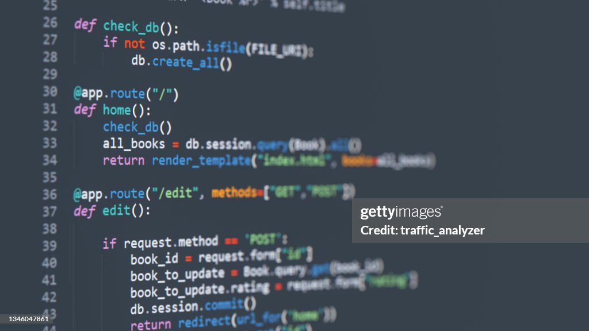

# Newspaper Advertisement Analyzer (Server)
 



## Table of Contents
- [Introduction](#introduction)
- [Features](#features)
- [Technologies Used](#technologies-used)
- [Environment Setup](#environment-setup)
- [Usage](#usage)
- [Database Configuration](#database-configuration)
- [Contributors](#contributors)


## Introduction

Welcome to the Newspaper Advertisement Analyzer (Server) repository! This server component is an essential part of our comprehensive application designed to extract key information from newspaper advertisements using Natural Language Processing (NLP) techniques. The server processes requests from the frontend, analyzes advertisements, and sends relevant information back to the client.

## Features

1. **Advertisement Analysis:** Utilizes NLTK, pytesseract, Specy, and other libraries to extract vital details from newspaper advertisements.

2. **Flask API:** Built on the Flask web framework, providing RESTful API endpoints for communication with the frontend.

3. **MongoDB Integration:** Stores extracted information in a MongoDB database hosted on MongoDB Atlas using the pymongo driver.

4. **Frontend Communication:** Serves as the backend for the frontend application, facilitating the exchange of data and results.


## Technologies Used

The Newspaper Advertisement Analyzer (Server) relies on a modern technology stack to accomplish its objectives:

- **Flask:** The primary web framework used to create the server.

- **NLTK (Natural Language Toolkit):** Used for natural language processing tasks.

- **pytesseract:** Enables optical character recognition (OCR) to extract text from images.

- **Specy:** A library for parsing and analyzing structured documents.

- **Newspaper:** Used for scraping articles from news websites.

- **Beautiful Soup:** A library for web scraping and parsing HTML and XML documents.

- **MongoDB:** The NoSQL database for storing and managing extracted data.

- **pymongo:** The MongoDB driver for Python to interact with the database.


## Environment Setup

To set up your development environment, follow these steps:

Create a Python virtual environment:
   ```shell
   python -m venv venv
  ```
Activate the virtual environment:
   ```shell
   source venv/bin/activate   # On macOS and Linux
   venv\Scripts\activate      # On Windows
  ```

Install Flask and other dependencies from the requirements.txt file:
   ```shell
   pip install -r requirements.txt
  ```
   
## Usage
Create a Python virtual environment:
   ```shell
   python main.py
  ```
Access the API at http://localhost:5000.

## Database Configuration
Configure your application's database settings in the environment variables. Make sure to provide the connection string for your MongoDB Atlas instance.
  ```shell
  # Example .env.py
  MONGODB_URI = "your_mongodb_uri_here"
  ```

## Contributors

- [Chanuka Lakshan Chandra Yapa](https://github.com/Chanuka-ChandraYapa) - Frontend Developer
- [Nadun Sanjeevana](https://github.com/NadunSanjeevana) - Backend Developer
- [Tharindu Madhusanka](link-to-contributor2-profile) - NLP Developer


